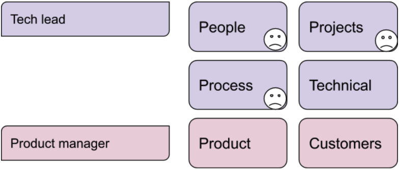
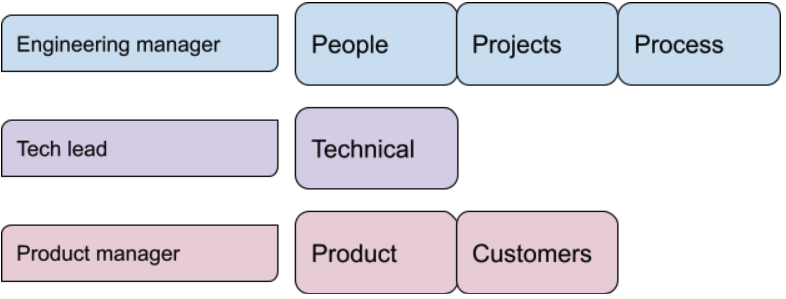

<re-img src="manager.jpg"></re-img>

## What should an Engineering Manager own?

Companies break up the roles and responsibilities of an engineering manager in many ways. This post describes the various ways to divide those responsibilities. I also provide the tradeoffs.

## Tech lead responsibilities

Many startups start out with a tech lead model. It’s fine for the early stages of a company, but tends to be something you outgrow.

* A Tech Lead manages people, projects, and process. They also lead the technical decision-making.
* People management suffers, because the Tech Lead has so many responsibilities. And they’re often not an Engineering Manager by training. 
* Process suffers, because the Tech Lead has so many responsibilities. And they’re often not an Engineering Manager by training.
* Project management suffers, because the Tech Lead has so many responsibilities. And they may not have experience with project management.
* The Technical Lead oversees the quality of the team’s technical work. They help their team get better at technical thinking. They ensure the team's technical plans are well reasoned and future-proof. 
* The Product Manager talks with customers and integrates feedback from many sources. They prioritize the team's work. They also make sure the team has context so they can build high value software.

## Engineering manager runs projects

This is the approach I gravitate towards. With this approach, you have an Engineering Manager, Product Manager, and Tech Lead. 

* The Engineering Manager handles people management. They coach their team members to make them more impactful. 
* The Engineering Manager runs projects: project breakdown, sequencing, risk management, and project communication. This gives them a day to day view of the team’s work, and helps them be effective coaches for their team.
* The Engineering Manager manages the team’s process. They adapt and improve the way the team operates. This helps the team always improve. 
* A Technical Lead oversees the quality of the team’s technical work. They help their team get better at technical thinking. They ensure the team's technical plans are well reasoned and future-proof. 
* The Product Manager talks with customers and integrates feedback from many sources. They prioritize the team's work. They also make sure the team has context so they can build high value software.

## Product manager runs projects

The intention is to have the Product Manager heavily involved in the team’s work. And to have highly technical engineering managers, who review code and sometimes even write code. At least some parts of Google operate with this model. 

* The Engineering Manager handles people management. They coach their team members to make them more impactful. 
* The Engineering Manager manages the team’s process. They adapt and improve the way the team operates. This helps the team always improve. 
* The Engineering Manager oversees the quality of the team’s technical work. They help their team get better at technical thinking. They ensure the team's technical plans are well reasoned and future-proof. Since the manager is in a position of power, this can cause problems. These problems can happen because people won't want to oppose their manager's views. Also, Engineering Managers can find it hard to focus on technical work. Alternatively, you can have a Tech Lead handle this area. That can work okay, but has a disadvantage. The Engineering Manager will then be too far from the work. This will cause them to not be able to guide the team's process or coach their team. 
* The Product Manager runs projects: project breakdown, sequencing, risk management, and project communication. This gives them a day to day view of the team’s work, and helps them give lots of context to team members. 
* The Product Manager talks with customers and integrates feedback from many sources. They prioritize the team's work. They also make sure the team has context so they can build high value software.
* Because the Product Manager is so focused on the team, they spend less time with customers. It's difficult to balance both aspects of the job when you're responsible for projects. I view this as a major disadvantage. 

## Single threaded owner

The Single Threaded Owner owns everything. They can hire people to delegate parts of their job. I have a longer [experience report on the Single Threaded Owner model](/implementing-amazons-single-threaded-owner-model/). Amazon popularized this approach. 

* The Single Threaded Owner (STO) owns everything. They either do the work themselves, or find someone to delegate to. 
* The STO manages people. They coach their team members to improve their impact. 
* The STO may run projects or have a project manager run the project. That person does project breakdown, sequencing, risk management, and project communication. 
* The STO manages the team’s process. They alter the way the team operates to be more effective. 
* The STO handles the quality of the team’s technical work. They  can delegate that responsibility. They help their team get better at technical thinking. They ensure the team's technical plans are well reasoned and future-proof. 
* The STO or a Product Manager talk with customers and integrate feedback from many sources. They prioritize the team's work. They also make sure the team has context so they can build high value software.

## SCRUM model

The SCRUM approach is a classic approach to software development. It doesn’t explicitly call out the managerial responsibilities. Here’s an [overview of SCRUM](https://www.scrumalliance.org/ScrumRedesignDEVSite/media/ScrumAllianceMedia/Files%20and%20PDFs/Community/Articles/2015/SCRUM-in-Agile.pdf). 

* It’s not specified in SCRUM how people management works. Usually that person takes on the Scrummaster or Product Owner role. Ignore that the Scrummaster[ should not have authority over the team](https://www.scrumalliance.org/ScrumRedesignDEVSite/media/ScrumAllianceMedia/Files%20and%20PDFs/Community/Articles/2015/SCRUM-in-Agile.pdf). Coaching individual team members tends to suffer. The manager may not be close enough to the work to coach the team member.
* You don’t see a lot of project management with SCRUM. It’s all focused on points or burndown charts. SCRUM teams I've worked with have neglected project breakdown, sequencing, and risk management. SCRUM divides project responsibilities between the Product Owner and the Scrummaster.
* Incentives for the Scrummaster are to focus on process and meetings. They tend to go overboard with it. They tend to lean on process too much.
* The team owns the quality of their technical plans and work. It’s generally done in an egalitarian way. Which can be good if the team functions well. 
* The Product Owner acts as a lightweight product manager. The Product Owner role is a subset of the Product Manager role. Generally, a Product Owner[ will not do the job as well](https://svpg.com/product-manager-vs-product-owner-revisited/).

## Summary

<table border="1" cellpadding="5" cellspacing="0">
  <tr>
   <th>Area of focus
   </td>
   <th colspan="5" >Model
   </td>
  </tr>
  <tr>
   <td>
   </td>
   <td>Engineering Manager (EM) does projects
   </td>
   <td>Product Manager (PM) does projects
   </td>
   <td>Tech lead (TL)
   </td>
   <td>Single threaded owner (STO)
   </td>
   <td>SCRUM
   </td>
  </tr>
  <tr>
   <th>People
   </td>
   <td>EM
   </td>
   <td>EM
   </td>
   <td>TL (poorly)
   </td>
   <td>STO
   </td>
   <td>Manager (poorly)
   </td>
  </tr>
  <tr>
   <th>Process
   </td>
   <td>EM
   </td>
   <td>EM
   </td>
   <td>TL (poorly)
   </td>
   <td>STO
   </td>
   <td>Scrummaster (poorly)
   </td>
  </tr>
  <tr>
   <th>Projects
   </td>
   <td>EM
   </td>
   <td>PM
   </td>
   <td>TL (poorly)
   </td>
   <td>STO or project manager
   </td>
   <td>Shared (poorly)
   </td>
  </tr>
  <tr>
   <th>Technical leadership
   </td>
   <td>TL
   </td>
   <td>EM (poorly)
   </td>
   <td>TL
   </td>
   <td>STO or TL
   </td>
   <td>Team, undefined
   </td>
  </tr>
  <tr>
   <th>Product
   </td>
   <td>PM
   </td>
   <td>PM
   </td>
   <td>PM
   </td>
   <td>STO or PM
   </td>
   <td>Product owner (poorly)
   </td>
  </tr>
  <tr>
   <th>Talk with customers
   </td>
   <td>PM
   </td>
   <td>PM (poorly)
   </td>
   <td>PM
   </td>
   <td>STO or PM
   </td>
   <td>Product owner (poorly)
   </td>
  </tr>
</table>

## Transitions

Moving between these models is where things get hard. For example, let's say you decide to give your Engineering Manager responsibility for Projects. If you haven't been hiring people who have project management experience, that might be a stretch. You'll need a plan to uplevel their skills. 

## Feedback

I have experience with all of these models listed above. One model I didn't include is the Engineering Manager who runs People, Process, and Technical, but works with a Project Manager. I’m sure it’s possible to be successful with any of these models. I welcome your feedback and comments!

Also, be sure to [subscribe](/subscribe/) if you’d like to be notified of future posts.

Image by <a href="https://pixabay.com/users/markiss33311-20814146/?utm_source=link-attribution&amp;utm_medium=referral&amp;utm_campaign=image&amp;utm_content=6116282">Marcus Williams</a> from <a href="https://pixabay.com/?utm_source=link-attribution&amp;utm_medium=referral&amp;utm_campaign=image&amp;utm_content=6116282">Pixabay</a>