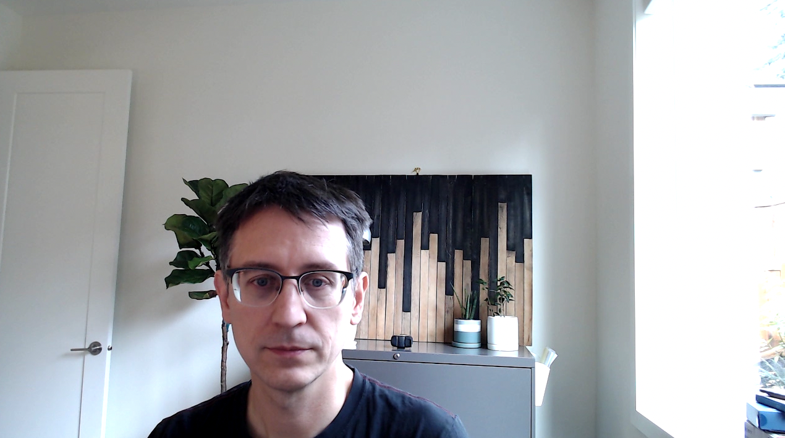

<re-img src="dslr.jpg"></re-img>

### Why set up a DSLR for videoconferencing?

Almost all of my professional life is done via meetings online. So I thought I should invest in things that make it easier to interact with me -- easier to hear and see. I saw two people who had invested in DSLR setups: [Jason Yee](https://www.linkedin.com/in/gitbisect/), and [Derek Steer](https://www.linkedin.com/in/dereksteer/). They stood out in Zoom meetings, because they were very clear and the camera was tight in on their face. 

### How is it using a DSLR as a webcam?

It's not perfect. My setup is fiddly, and I find it often stops working. I’m not quite sure why. I suspect it’s something to do with the video capture card, but it could be anywhere in the chain, including in Mac OS. 

The results are worth it to me, but the frustration is real. These are issues I have regularly:

* Sometimes the video feed just cuts out. This is the most frequent issue. It seems to take a restart (sometimes two) to get this to work again. 
* Sometimes the video feed looks distorted. Like I’m really skinny. This isn’t quite as frequent. 
* (Solved) Up until recently I was having near daily kernel panics. They seem to have stopped when I started plugging in two USB-C connections to my laptop instead of one. Maybe having a large monitor, DSLR video, and a few other devices plugged in to the same connection was the cause? I have no idea. I do know it happened across three different computers, and with clean installs of Mac OS, and the kernel panics are all in Apple code. I'm not even sure this is related to the DSLR. 

So all of this is to say the cost is a more complex setup. And that may result in having to do things like restart you computer right before an important meeting. 

### What does it look like? 

These aren't the best examples, but give you an idea of what the difference is. This is the view from my Macbook, sitting in a corner:

For a while I used a Logitech webcam. It was ... fine. 

And this is the view from the Sony a6000.

### Choosing a camera

I initially purchased a [Sony a5100](https://www.amazon.com/gp/product/B00MHPAFAG/ref=as_li_tl?ie=UTF8&tag=rubick-20&camp=1789&creative=9325&linkCode=as2&creativeASIN=B00MHPAFAG&linkId=f674c8fdb42ca9d0c31a84a758eaea84). It’s smaller than many alternatives, and has a handy flip up screen, so you can see what you’re shooting from the front. However, the external battery seemed to not power it forever — it would need to be removed and reinserted every time I used the camera. 

So I instead went with a [Sony a6000](https://www.amazon.com/gp/product/B07BYZ5YB7/ref=as_li_tl?ie=UTF8&tag=rubick-20&camp=1789&creative=9325&linkCode=as2&creativeASIN=B07BYZ5YB7&linkId=ae5ecdf669c9fdefa942169bd0804133). It seems like Sony cameras are some of the best supported for webcams, so if I were purchasing today, that’s probably what I would start with. But anything with clean video that can take a dummy battery and stay on for a long time is fine. Some DSLRs won't stay in video mode for long periods of time, so be sure to search for overheating and using it as a webcam. Here are a couple of sources that list cameras that should work (but you should search a bit before using it):

* [List of camera you can use](https://www.elgato.com/en/gaming/cam-link/camera-check) with Elgato Camlink
* This is another [list of cameras with clean video from Atmos](https://www.atomos.com/cameras)

I use the lens that came with the Sony, which has a 3.5-5.6/16-50 lens. It works fine for my purposes. If I were wanting to upgrade my lens, I’d follow [Jason Yee’s advice](https://docs.google.com/document/d/1PjocFpojp771gmmn22JcApPj-Sc_RqAKWvpXTIhz-aU/edit).

### You’ll need a dummy battery

You’ll need your DSLR to stay on while you’re using it. So for whatever type of camera you get, you’ll also need a power adapter that allows you to plug a power cord into the battery compartment so it runs off A/C power instead of a battery.

These are called "dummy batteries". I don’t believe mine is still available. But search for one that corresponds to your DSLR. 

### Video capture

You’ll need something that can take the raw video and get it into your camera with low latency. To learn more about this, Jason Yee [has a great explanation](https://docs.google.com/document/d/1PjocFpojp771gmmn22JcApPj-Sc_RqAKWvpXTIhz-aU/edit). 

* [Elgato Camlink](https://www.amazon.com/gp/product/B07K3FN5MR/ref=as_li_tl?ie=UTF8&tag=rubick-20&camp=1789&creative=9325&linkCode=as2&creativeASIN=B07K3FN5MR&linkId=54c5381236996362db5fe541f4f8dd80). I tried this, but it stopped working. 
* I also am using a cheap HDMI video capture device that Jason recommended. It was only $10 instead of $130, but seems to work. I sometimes wonder if it is the source of flaky behavior, but it worked better than the Camlink. It did give a slight red tint to the image. I was okay with that. However, it’s no longer available on Amazon, so you’ll need to find some other option.

### Cables and such

It would be nice if things just plugged into USB-C on my laptop. Most cameras output Micro-HDMI, so you’ll need: 

* [Micro-HDMI to HDMI cable](https://www.amazon.com/gp/product/B06WW3LPWL/ref=as_li_tl?ie=UTF8&tag=rubick-20&camp=1789&creative=9325&linkCode=as2&creativeASIN=B06WW3LPWL&linkId=a172bb0b67d2e582a4faff0f0fed3ced) ($10)

So from the camera, I have a this cable plugged in to the video capture device. That in turn is plugged in to a [CalDigit Thunderbolt dock](https://www.amazon.com/gp/product/B07CZPV8DF/ref=as_li_tl?ie=UTF8&tag=rubick-20&camp=1789&creative=9325&linkCode=as2&creativeASIN=B07CZPV8DF&linkId=20a1f3959c4a6e2a77c3f000630fa940). That is plugged in to the USB-C on my laptop. The CalDigit is not a necessary purchase -- I did this because I was trying to diagnose some VERY annoying USB problems and I read it might be a solution. Somewhere in this is a weakness in my setup, I suspect.

### Setting the DSLR above your screen: get a mount

I use this mount to put the DSLR right above my screen. It’s easy to figure out when you receive it. It basically clamps onto the back of my desk.

* [Elgato Multi-mount](https://www.elgato.com/en/multi-mount-system) - this seems to be the best one, but when I was buying it, it was impossible to get in the US. I couldn’t find a better alternative. I ordered this from the UK, and it took a month to get here. 

### Bathe my face in light

Some people may not like the light in their face. I live in a climate where we yearn for sunshine and only see it for fleeting moments in the summer. The light does look good on camera. But I also like that it makes me feel like I’m in a bright space. I have two of these. You can set the color temperature and brightness. Weirdly they are controlled via an app or menu bar on the Mac. They work, but it’s weird that it’s always digitally controlled. 

* [Elgato Key Light Air](https://www.amazon.com/gp/product/B082QHRZFW/ref=as_li_tl?ie=UTF8&tag=rubick-20&camp=1789&creative=9325&linkCode=as2&creativeASIN=B082QHRZFW&linkId=60141e268c84ab0e4d1d2f2823fe8cac)

Here's the difference between light and no light. Before:

And after, with the lighting:

### I want to talk without a headset: get a microphone

I got a Blue Yeti microphone. It’s been fine. One challenge nobody told me about (but I should have anticipated) is that if you have an external microphone, it will get feedback from any other speaker. However, if you plug your speaker into the headphone’s INPUT, it is a lot better. I purchased some Bose mini-speakers, and this is really nice! I can talk without a headset on, and people hear me well. And I can hear them great, and control the volume with a volume nob. It's a real pleasure to not need a headset during meetings all day.

The challenge with this is that I’ve found some applications don’t handle the input and output device being the same device correctly. Zoom recognizes it fine on a Mac. Google Meet does not. 

I use [Krisp.ai](https://krisp.ai) to reduce echo, since my office has wood floors and echoes. Zoom now has some echo reduction, but I haven’t yet compared the two. Krisp isn't perfect -- I've had it just turn off (and require a restart). But it's been good enough I haven't ditched it.

### Make it sound good with shock mounts and pop filters

A pop filter reduces extra noises on high quality microphones. They’re easy to install. A shock mount isolates the microphone from physical bumps and such. I never got one. But I did get a mount for my microphone. 

* [Aokeo pop filter](https://www.amazon.com/gp/product/B01N21H9WY/ref=as_li_tl?ie=UTF8&tag=rubick-20&camp=1789&creative=9325&linkCode=as2&creativeASIN=B01N21H9WY&linkId=6352aac8ce3eeb55d7246363d95b8951). 

### Further reading

* Besides the articles by Jason Yee, I found one of the most helpful posts was this one by [Matt Stauffer](https://mattstauffer.com/blog/setting-up-your-webcam-lights-and-audio-for-remote-work-podcasting-videos-and-streaming/)

## Feedback

I'm far from an expert on all this, so if you have any ideas on things I'm doing wrong, let me know! Also happy to answer questions on it. 

Also, be sure to [subscribe](/subscribe/) if you’d like to be notified of future posts.

## Thank you

Thank you to [Drew Stokes](https://www.linkedin.com/in/drewstokes/) for pointing out the challenges of overheating.

Image by <a href="https://pixabay.com/photos/sony-a6000-ilce-6000-camera-4808408/">Farbsynthese</a> from <a href="https://pixabay.com/">Pixabay</a>