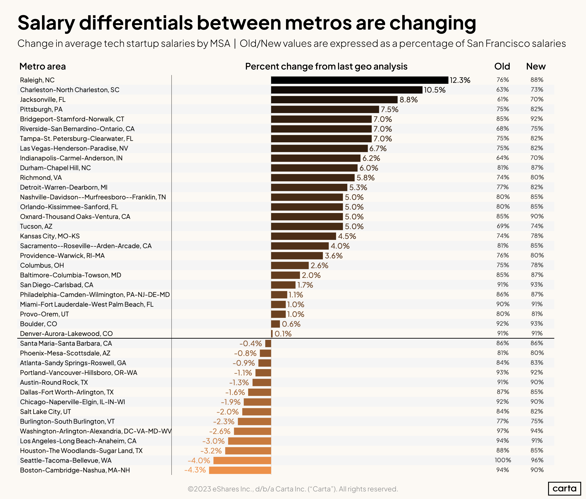

## General overview of comp and equity

* [What great engineering managers need to know about comp and equity](https://www.rubick.com/compensation-and-equity/)

* [Good LinkedIn post on equity](https://www.linkedin.com/posts/marcbaselga_friend-i-got-an-amazing-offer-50000-shares-activity-7279515466664992768-P09C/) some things to think about when taking equity in an offer

## Implementing pay equity / point based pay

* [Role based pay](https://medium.com/@colleenwheelermccreary/innovating-on-compensation-role-based-pay-f70db5fd18e5) - an experience report on implementing pay equity

* [Tradeoffs with implementing pay equity.](https://mollyg.substack.com/p/implementing-compensation-for-startups) Molly Graham.

* [Implementing pay equity](https://www.rubick.com/implementing-pay-equity/). by Jade

## Geo comp

* From Carta Insights (2023) 

## Salaries

* Levels.fyi is a site that aggregates a lot of salary information. However, to do real comparisons can sometimes be hard. https://www.levels.fyi/t -- seems high to me, but you can filter by location.

* Indeed.com has a page that shows regional salaries. But it's only averages: https://www.indeed.com/career/product-manager/salaries

* I usually work with the HR team, and they subscribe to some sort of salary tool service (like [https://www.pave.com](https://www.pave.com/) ). We plug in the titles and locations and so on.

### Product specific salaries

* Here is Optimizely's: https://medium.com/product-experimentation/optimizelys-product-manager-leveling-framework-1cfdc0123147

* And Intercom's: https://blog.intercomassets.com/blog/wp-content/uploads/2019/05/Intercom-PM-job-ladder-Logo.pdf

* [\[https://www.lennysnewsletter.com/p/how-much-product-managers-make-in\]](https://www.lennysnewsletter.com/p/how-much-product-managers-make-in) https://www.lennysnewsletter.com/p/how-much-product-managers-make-in

