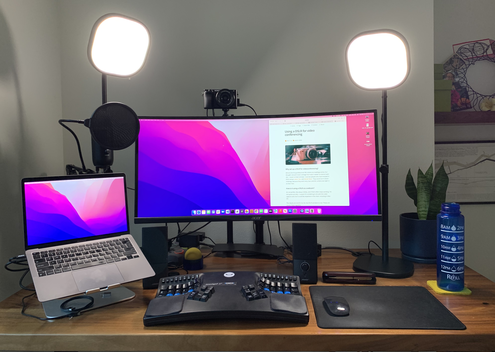

import { Image } from 'astro:assets';
import dslrImage from './dslr.jpg';

<Image src={dslrImage} alt="Dslr" width={800} />

## Why set up a DSLR for videoconferencing?

Almost all of my professional life is done via meetings online. So I thought I should invest in things that make it easier to interact with me -- easier to hear and see. I saw two people who had invested in DSLR setups: [Jason Yee](https://www.linkedin.com/in/gitbisect/), and [Derek Steer](https://www.linkedin.com/in/dereksteer/). They stood out in Zoom meetings, because they were very clear and the camera was tight in on their face. 

## What would I do nowadays?

My setup is a little old, so I'll note what I would do differently nowadays.

## What does it look like? 

These aren't the best examples, but give you an idea of what the difference is. This is the view from my Macbook, sitting in a corner:

And this is the view from the Sony a6000.

## Choosing a camera

If you're doing this today, I'd recommend checking out the mirrorless DSLRs designed specifically for streaming, that connects via USB-C. 

My setup is older, and I wouldn't choose the same thing nowadays. I initially purchased a [Sony a5100](https://www.amazon.com/gp/product/B00MHPAFAG/ref=as_li_tl?ie=UTF8&tag=rubick-20&camp=1789&creative=9325&linkCode=as2&creativeASIN=B00MHPAFAG&linkId=f674c8fdb42ca9d0c31a84a758eaea84). It’s smaller than many alternatives, and has a handy flip up screen, so you can see what you’re shooting from the front. However, the external battery seemed to not power it forever — it would need to be removed and reinserted every time I used the camera. 

So I instead went with a [Sony a6000](https://www.amazon.com/gp/product/B07BYZ5YB7/ref=as_li_tl?ie=UTF8&tag=rubick-20&camp=1789&creative=9325&linkCode=as2&creativeASIN=B07BYZ5YB7&linkId=ae5ecdf669c9fdefa942169bd0804133). Sony has had a long history with digital webcam support. If you're not using a mirrorless camera, you want a "clean" video that can take a "dummy" battery and stay on a long time. Some non-mirrorless DSLRs won't stay in video mode for long periods of time, so be sure to search for overheating and using it as a webcam. Here are a couple of sources that list cameras that should work (but you should search a bit before using it):

* [List of camera you can use](https://www.elgato.com/en/cam-link/camera-check) with Elgato Camlink. This is only if you're using non mirrorless DSLRs.
* This is another [list of cameras with clean video from Atmos](https://www.atomos.com/compatible-cameras)

I started out using the lens that came with my Sony, which has a 16-50mm, f/3.5-5.6 lens. It worked fine, but in retrospect I should have upgraded it much sooner. You can see what a difference it made if you look later in this article. 

## (For non-mirrorless) You’ll need a dummy battery

You’ll need your DSLR to stay on while you’re using it. So for whatever type of camera you get, you’ll also need a power adapter that allows you to plug a power cord into the battery compartment so it runs off A/C power instead of a battery.

These are called "dummy batteries". I don’t believe mine is still available. But search for one that corresponds to your DSLR.

You probably won't need this for mirrorless cameras that are designed for streaming.

## (Non-mirrorless) video capture

You’ll need something that can take the raw video and get it into your camera with low latency. To learn more about this, Jason Yee [has a great explanation](https://docs.google.com/document/d/1PjocFpojp771gmmn22JcApPj-Sc_RqAKWvpXTIhz-aU/edit). 

* [Elgato Camlink 4k](https://www.amazon.com/gp/product/B07K3FN5MR/ref=as_li_tl?ie=UTF8&tag=rubick-20&camp=1789&creative=9325&linkCode=as2&creativeASIN=B07K3FN5MR&linkId=54c5381236996362db5fe541f4f8dd80). I'm on my second or third Camlink. The first time I tried it, it stopped working after a short while. In December 2021, I purchased it again, and it seems to have addressed two of the main issues I was having (with the video feeds cutting out). The whole setup is more reliable again.
* For two years, I used a cheap HDMI video capture device Jason Yee recommended. It was only $10 and worked fine. It did give a slight red tint to the image. However, it’s no longer available on Amazon, so you’ll need to find some other option. 

Most mirrorless DSLRs will connect just with USB-C. Easy.

## Cables and such

Again, skip this section if you're going mirrorless :)

It would be nice if things just plugged into USB-C on my laptop. Some older cameras output Micro-HDMI, so you’ll need: 

* [Micro-HDMI to HDMI cable](https://www.amazon.com/gp/product/B06WW3LPWL/ref=as_li_tl?ie=UTF8&tag=rubick-20&camp=1789&creative=9325&linkCode=as2&creativeASIN=B06WW3LPWL&linkId=a172bb0b67d2e582a4faff0f0fed3ced) ($10)

So from the camera, I have a this cable plugged in to the video capture device. That in turn is plugged in to a [CalDigit Thunderbolt dock](https://www.amazon.com/gp/product/B07CZPV8DF/ref=as_li_tl?ie=UTF8&tag=rubick-20&camp=1789&creative=9325&linkCode=as2&creativeASIN=B07CZPV8DF&linkId=20a1f3959c4a6e2a77c3f000630fa940). That is plugged in to the USB-C on my laptop. The CalDigit is not a necessary purchase -- I did this because I was trying to diagnose some VERY annoying USB problems and I read it might be a solution. Somewhere in this is a weakness in my setup, I suspect.

## Setting the DSLR above your screen: get a mount

I use this mount to put the DSLR right above my screen. It’s easy to figure out when you receive it. It basically clamps onto the back of my desk.

* [Elgato Multi-mount](https://www.elgato.com/en/multi-mount-system) - this seems to be the best one, but when I was buying it, it was impossible to get in the US. I couldn’t find a better alternative. I ordered this from the UK, and it took a month to get here. 

## Bathe my face in light

Some people may not like the light in their face. I live in a climate where we yearn for sunshine and only see it for fleeting moments in the summer. The light does look good on camera. But I also like that it makes me feel like I’m in a bright space. I have two of these. You can set the color temperature and brightness. Weirdly they are controlled via an app or menu bar on the Mac. They work, but it’s weird that it’s always digitally controlled. 

* [Elgato Key Light Air](https://www.amazon.com/gp/product/B082QHRZFW/ref=as_li_tl?ie=UTF8&tag=rubick-20&camp=1789&creative=9325&linkCode=as2&creativeASIN=B082QHRZFW&linkId=60141e268c84ab0e4d1d2f2823fe8cac)

Here's the difference between light and no light. Before:

And after, with the lighting:

That photo doesn't really do it justice.

## I want to talk without a headset: get a microphone

For a while, I used a Blue Yeti microphone. It was fine. One challenge nobody told me about (but I should have anticipated) is that if you have an external microphone, it will get feedback from any other speaker. However, some microphones (like the Blue Yeti) have an output for speakers. If you plug in your speaker to this output, apparently it helps reduce feedback. It seemed to for me. I purchased some Bose mini-speakers, and this setup ended up feeling great. I can talk without a headset on, and people hear me well. And I can hear them great, and control the volume with a volume nob. It's a real pleasure to not need a headset during meetings all day.

The challenge with this is that I’ve found some applications don’t handle the input and output device being the same device correctly. Zoom recognizes it fine on a Mac. Google Meet does not. 

I found the microphone didn't sound very good, because my office had a lot of echo in it. I didn't figure it out until I got a carpet, which made the sounds NOTICEABLY better. And I replaced the microphone with a cheaper microphone that sounded way better, the Audio-Technica ATR2100X. It's unfortunately not availabale any more.

## Make it sound good with shock mounts and pop filters

A pop filter reduces extra noises on high quality microphones. They’re easy to install. A shock mount isolates the microphone from physical bumps and such. I never got one. But I did get a mount for my microphone. 

* [Aokeo pop filter](https://www.amazon.com/gp/product/B01N21H9WY/ref=as_li_tl?ie=UTF8&tag=rubick-20&camp=1789&creative=9325&linkCode=as2&creativeASIN=B01N21H9WY&linkId=6352aac8ce3eeb55d7246363d95b8951). 

## Upgrading the camera lens

I realized the reason my picture was so dark is that my camera wasn't letting in very much light. So I purchased a [Meike 28mm f/2.8 camera lens](https://www.amazon.com/gp/product/B01DZ5URFY?ie=UTF8&psc=1&linkCode=ll1&tag=rubick-20&linkId=b1a0917af9598d78394ab87063641aef&language=en_US&ref_=as_li_ss_tl). I'm so happy with this purchase.

Here's the original Sony 16-50mm f/3.5-5.6 lens that came with the camera:

Here's the view from Meike camera lens.

I think this is probably the best photo to show what the camera looks like most days.

Some things to note:

* The Meike is a manual focus, fixed lenth lens. When using as a webcam, that means you set the focus and leave it there. If you move around a lot, that's not a good option for you.
* You can manually set the focal length on the Meike lens, to decide how much light and depth of field you want. 
* One annoyance with a zoom lens is when you turn it on, you have to zoom in and frame it each time. The Meike is easier because it starts always at the same Zoom level. However, you better be happy with how it frames the scene -- it isn't something you can adjust. 
* I'm amazed how much more light it brought in. It significantly improves the view.
* The Meike lens cap is also easier to put over the lens, as a privacy cap. The Sony cap is less satisfying to put over the lens.

## What does your desk look like?

There are the aethetic aspects of the decision as well. It definitely adds a lot of cords to my desk. This is a minimally straightened out view of my desk (pretty close to how it looks most of the time, except I usually have a few more things on it):

## Further reading

* Besides the articles by Jason Yee, I found one of the most helpful posts was this one by [Matt Stauffer](https://mattstauffer.com/blog/setting-up-your-webcam-lights-and-audio-for-remote-work-podcasting-videos-and-streaming/)

## What's next

If anything serious fails in my setup, or I were to do it over again, I'd use a mirrorless streaming DSLR for sure. So many fewer things that can go wrong.

## How has it been with my (older setup)

Honestly, it was annoying to set up. But I get a lot of comments on my camera setup, even today. People always comment, "why is your camera so clear?"

The results are worth it to me, but the frustration was real. These are issues I have had:

* (Solved) For a number of months, my video feed would sometimes just cut out. It seemed to take a restart or two to get it working again. I believe this was due to the cheap video capture device I was using. After going back to the Camlink (as I describe below), things began being reliable again. 
* (Solved) Sometimes the video feed looked distorted. Like I’m really skinny. This seemed to be another issue with the video capture device. 
* (Solved) Had issues with Google Meet camera showing up.
* (Solved) For a while, I had near daily kernel panics. They seem to have stopped when I started plugging in TWO USB-C connections to my laptop instead of one. Maybe having a large monitor, DSLR video, and a few other devices plugged in to the same connection was the cause? I have no idea. I do know it happened across three different computers, and with clean installs of Mac OS, and the kernel panics are all in Apple code. I'm not even sure this is related to the DSLR. 
* When I use the camera with most web browser based videoconferencing solutions, I got an echo in the sound, because Zoom seemed to be the only solution out there that can use a microphone as both a speaker and microphone. 
* If I leave the camera on for a very long time, it needs to be cooled down or restarted. 

So all of this is to say the cost of having a DSLR setup is that it is more complex. It can result in having to do things like restart you computer right before an important meeting. Diagnosing these problems can be hard, because there can be so many places the problem can be. 

## Feedback

I'm far from an expert on all this, so if you have any ideas on things I'm doing wrong, let me know! Also happy to answer questions on it. 

## Thank you

Thank you to [Derek Steer](https://www.linkedin.com/in/dereksteer/) for the advice on mirrorless lenses, and for getting me into all of this. Big thanks to [Jason Yee](https://www.linkedin.com/in/gitbisect/) for sharing his [setup notes](https://docs.google.com/document/d/1PjocFpojp771gmmn22JcApPj-Sc_RqAKWvpXTIhz-aU/edit). Thank you to [Drew Stokes](https://www.linkedin.com/in/drewstokes/) for pointing out the challenges of overheating. Thank you to [Adam Larson](https://www.linkedin.com/in/adam-larson-seattle/) for getting me to post a photo of my desk.

Image by <a href="https://pixabay.com/photos/sony-a6000-ilce-6000-camera-4808408/">Farbsynthese</a> from <a href="https://pixabay.com/">Pixabay</a>
