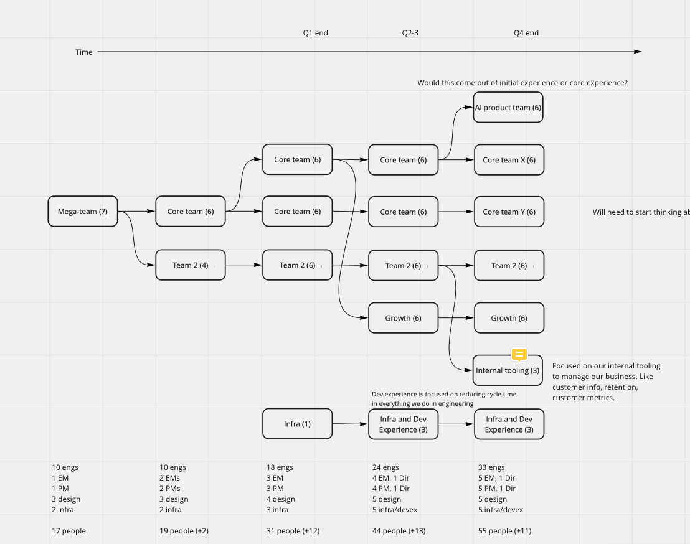

## Use power structures deliberately

* This is a new favorite post of mine from Molly Graham, on [how to evolve your Company structure over time](https://mollyg.substack.com/p/startup-org-design-power-centers). It's quite insightful, helped me see things in a new way, and will be something I refer to in the future. A very useful read! @jade 

# Headcount and AI

* [AI layoffs are backfiring in 2026](https://www.theregister.com/ai-and-ml/2026/05/06/ai-layoffs-backfire-as-cutting-staff-doesnt-cut-it-firms-warned/5230631) 

## Mitosis method

## Math behind org design

* [Distributed systems, coda hale](https://codahale.com/work-is-work/)
* [The SaaS org chart, and how it should evolve as a startup grows](https://sacks.substack.com/p/the-saas-org-chart) Pretty well done. You can argue about details, but the high level pictures is pretty accurate.
